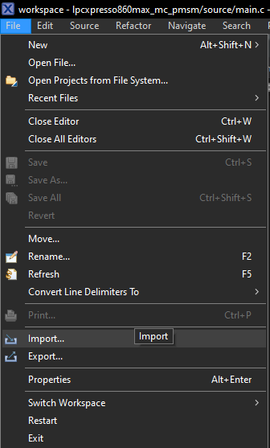
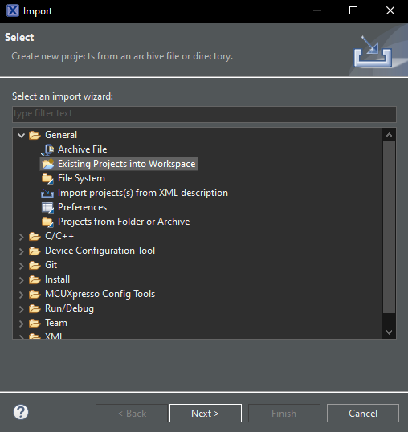
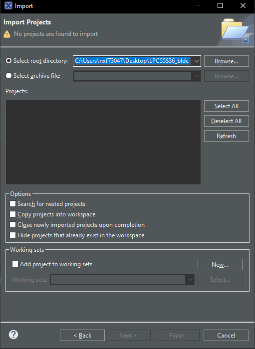
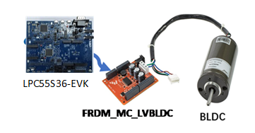
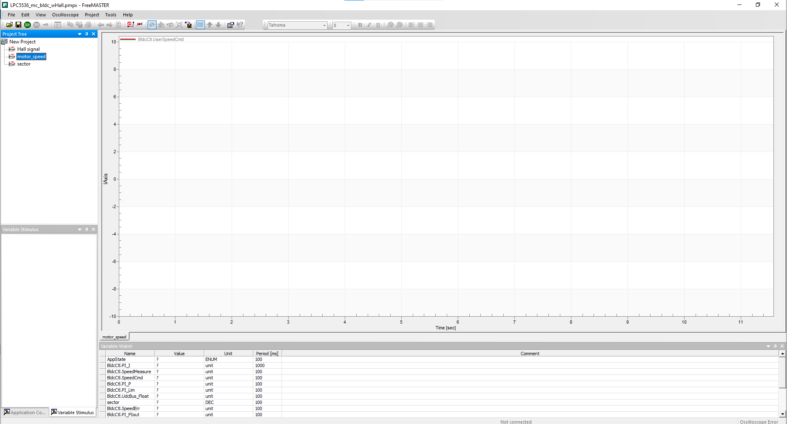
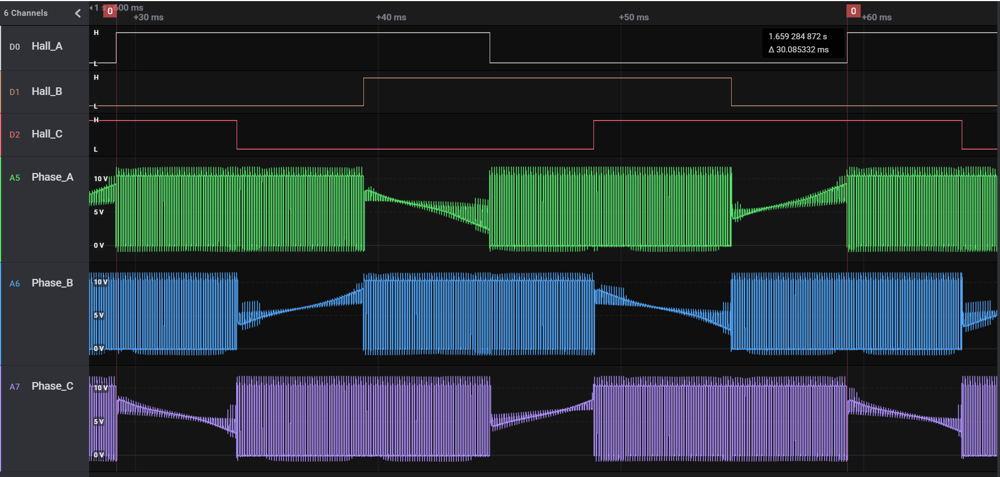

# NXP Application Code Hub

## AN13571: LPC55S36_mc_bldc_wHall
This application note describes the implementation of the 3-phase Brushless DC motor (BLDC) control with Hall sensor based on the NXP LPC55S36 processor. Please refer to AN13571 for complete instructions on how to use this software. <a href="https://www.nxp.com/docs/en/application-note/AN13571.pdf">https://www.nxp.com/docs/en/application-note/AN13571.pdf</a>. The LPC55S3x/LPC553x is an Arm Cortex-M33 based microcontroller for embedded applications. These devices include up to 256 KB on-chip flash, up to 128 KB of on-chip SRAM, one SCTimer/PWM, eight flexible serial communication peripherals (which can be configured as a USART, SPI, high speed SPI, I2C, or I2S interface), two 16-bit 2.0 Msamples/sec ADCs capable of four simultaneous conversions, four comparators, two temperature sensors, three 12-bit 1 Msample/sec DACs, three OpAmps, two FlexPWM timers. The Arm Cortex-M33 provides a security foundation, offering isolation to protect valuable IP and data with TrustZone® technology. It simplifies the design and software development of digital signal control systems with the integrated digital signal processing (DSP) instructions. This application note mainly introduces the principle of BLDC six-step control with hall sensor, hardware and software implementation, including a detailed peripheral setup and driver description. 

#### Boards: LPCXpresso55S36
#### Categories: Motor Control
#### Peripherals: ADC, PWM, GPIO, TIMER
#### Toolchains: mcux

## Table of Contents
1. [Software](#step1)
2. [Hardware](#step2)
3. [Setup](#step3)
4. [Results](#step4)
5. [FAQs](#step5) 
6. [Support](#step6)
7. [Release Notes](#step7)

## 1. Software
- Download and install [MCUXpresso IDE V11.8.0 or later](https://nxp.flexnetoperations.com/control/frse/product?entitlementId=590613497&lineNum=1&authContactId=157658197&authPartyId=171870707). 
- Download and install the latest version of [MCUXpresso Config Tool](https://www.nxp.com/design/software/development-software/mcuxpresso-software-and-tools-/mcuxpresso-config-tools-pins-clocks-and-peripherals:MCUXpresso-Config-Tools).
- Download and install the latest version of [FreeMASTER](https://www.nxp.com/freemaster).
- Download the [attached software package](https://www.nxp.com/docs/en/application-note-software/AN13571SW.zip) of [AN13571](https://www.nxp.com/docs/en/application-note/AN13571.pdf).(Based on [SDK_2_14_0_LPCXpresso55S36](https://mcuxpresso.nxp.com/en/welcome))
## 2. Hardware
- [LPC5536/LPC55S36 Evaluation Board](https://www.nxp.com/design/software/development-software/mcuxpresso-software-and-tools-/lpcxpresso-boards/lpcxpresso55s36-development-board:LPCXpresso55S36)(REV.D).
- [FRDM-MC-LVBLDC](https://www.nxp.com/part/FRDM-MC-LVBLDC#/).
- [LINIX 45ZWN24 BLDC motor](https://www.nxp.com/design/development-boards/freedom-development-boards/mcu-boards/low-voltage-3-phase-motor-for-frdm-platform:FRDM-MC-LVMTR).
- Personal Computer
- Micro-usb cable and 12V adaptor.
## 3. Setup

### 3.1 Step 1
Open MCUXpresso IDE and choose File->import.

And select General->Existing Projects into Workspace.

Click "Browse.." to select the local path of the downloaded software compression package.

### 3.2 Step 2
Connect the FRDM-MC-LVBLDC shield to the "MOTOR1" arduino connector of EVK board, which on the bottom side of the board. Connect the 3-phase wire of the motor to the J7 connector on FRDM-MC-LVBLDC accroding to phase sequence and hall signal wire to J8. Power the FRDM-MC-LVBLDC board with a 12V adaptor.

Compile the project and use a micro-USB cable to connect to the EVK board via LINK2 connector. Use MCU-link to download programme into MCU.

### 3.3 Step 3

Press SW1 on EVK board to control the motor to run or stop. Or use FreeMASTER project "LPC5536_mc_bldc_wHall.pmpx" in the code package to control the motor, change rotor speed and obverse the speed or other value.

## 4. Results
When the motor runs at a speed of 1000rpm, the signal of the Hall sensor changes alternately, and the voltage of the motor winding terminal is chopped according to the output of the Hall signal, and the opposite potential is a zero-crossing waveform without conduction.

## 5. FAQs

## 6. Support
For other rapid-development software bundles please visit the Application Software Packs page. For SDK examples please go to the MCUXpresso SDK and get the full delivery to be able to build and run examples that are based on other SDK components.
#### Project Metadata
<!----- Boards ----->

<!----- Categories ----->

<!----- Peripherals ----->
   

<!----- Toolchains ----->

Questions regarding the content/correctness of this example can be entered as Issues within this GitHub repository.

>**Warning**: For more general technical questions regarding NXP Microcontrollers and the difference in expected funcionality, enter your questions on the [NXP Community Forum](https://community.nxp.com/)

## 7. Release Notes
| Version | Description / Update                           | Date                        |
|:-------:|------------------------------------------------|----------------------------:|
| 1.0     | Initial release on Application Code HUb        | July 10th 2023 |

